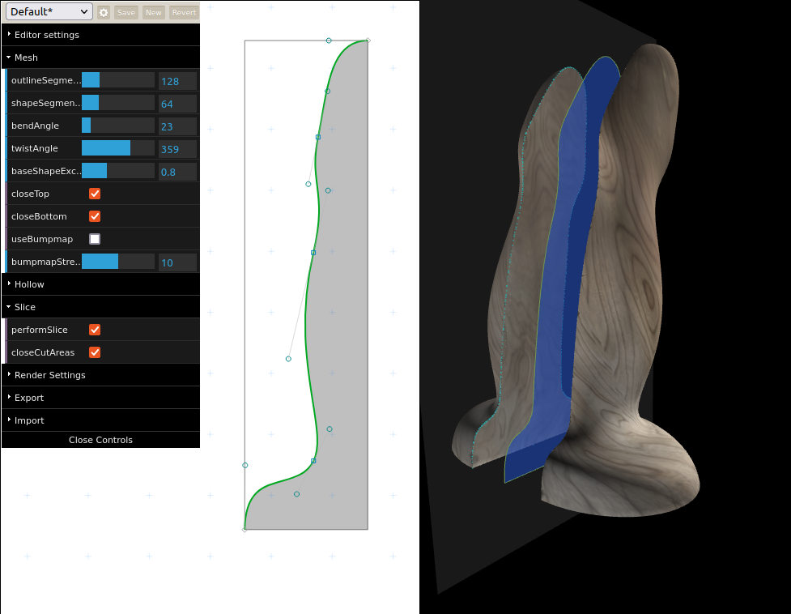

# Codename NGDG

Because 3d printing, web 3d, and dildos are fun.

#### Table of contents

- [Bugs](#bugs)
- [todos](#todos)
- [changelog]

## Bugs

- When slicing the mesh with open bottom there are mesh errors.
- Front face, back face and double face switching is not working.

## Todos:

- [x] Configure webpack to handle type definitions in node_modules correctly.
- [x] Port all vanilla JS parts to Typescript.
- [ ] Arrange splits on plane.
- [ ] Update to THREE >= r125. Replace all THREE.Geometry and THREE.Face3 instances by proper BufferGeometries
      (not supported any more since r125). See https://sbcode.net/threejs/geometry-to-buffergeometry/ for details.
- [x] Rename base branch to 'main'.
- [x] Create a Typescript port from mapbox/earcut.
- [ ] Create a Typescript port from tdhooper/threejs-slice-geometry.
- [x] Add a proper Typescript interface for all available dildo generation options.
- [ ] STL-Export: merge all exportable geometries together and export as one.
- [ ] Add a 'Material' switch/tab.
- [ ] Update the package.json's copy scripts (using OS dependent `cp` command). Better use an npm compatible copy here.
- [x] Define one global library export to avoid environment pollution.
- [x] Remove unused build libraries: babel, rollup.
- [x] Remove old alloyfinger library. Replace by alloyfinger-typescript.
- [ ] Add a session storage for the current settings, especially the Bézier curve and bend.
- [ ] Make the Bézier curve more look like in the old version.
- [ ] Add horizonal and vertical scale like in the old version.

### Changelog

- 2021-12-03
  - Refactored the code for resizing the path.
  - Upadted to plotboilerplate@1.14.0.
  - Refactored the code to draw rulers into a separate file.
  - Added action buttons for quickly start over with a new model, and to scale the view to best screen fit.
  - Can restore older models from localstorage now. Models are saved in a 10 second interval.
- 2021-12-01 (World AIDS day)
  - Refactored the resize handles into a new helper class: BezierResizeHelper.
  - Added basic localstorage support to the ConfigIO class.
- 2021-11-30
  - Added resize handles to vertically and horizontally resize the model (path).
- 2012-11-12
  - Added basic rulers to the 2d canvas.
  - Fixed the broken scale-to-best-fit function.
- 2021-09-27
  - Replaced in internal earcut implementation by an node module (https://www.npmjs.com/package/earcut-typescript).
- 2021-09-26
  - Replaced the old build tool chain by a clean one (https://github.com/IkarosKappler/tswebpack).
- 2021-08-29
  - Ported most of the classes to Typescript.
- 2021-08-04
  - Complete refactor.
  - Using PlotBoilerplate for 2D drawing now.
  - Using AlloyFinger-typescript for touch gestures.
- - BREAK - DID OTHER STUFF IN BETWEEN - AND CORONA WAS/IS THERE -
- 2018-08-30
  - Moved the listener setup to the dildo class.
  - Added drag listeners to last end points and last end control points.
- 2018-08-29
  - Added Vertex.multiplyScalar(scalar) (as in THREE.Vector2.multiplyScalar).
  - Added crosshair draw for vertex positions.
  - Added CubicBezierCurve.translate(amount).
  - Added top path and bottom path.
- 2018-08-28
  - Function for resizing draw canvas to parent now, not full window.
- 2018-08-27
  - Added fecha.js for date formatting.
  - Added the VertexListeners class.
  - Added basic JSON<->Object transform for the Dildo class.
  - Added a basic dialog class.
- 2018-08-26
  - Initial commit.
  - Added a bezier-drag test in ./tests/.
  - Added the VertexAttr class.
  - Added attr (VertexAttr) attribute to the Vertex class.
  - Added a second draw-instace: one is for filling shapes, one is for drawing outlines.
- 2018-08-16
  - Refactored old dildo-generator classes.

###

Dependencies

- HTML5 Canvas
- HTML5 WebGL
- [threejs-slice-geometry](https://github.com/tdhooper/threejs-slice-geometry)

### Used Libraries

- dat.gui

### Credits

- [mapbox](https://github.com/mapbox/earcut) for the [earcut library](https://www.npmjs.com/package/earcut)
- [tdhooper](https://github.com/tdhooper/threejs-slice-geometry/) for the [threejs-slice-geometry library](https://www.npmjs.com/package/threejs-slice-geometry)
- [jkmott about computing vertex normals](https://meshola.wordpress.com/2016/07/24/three-js-vertex-normals/) as used in the `computeVertexNormals` function.
