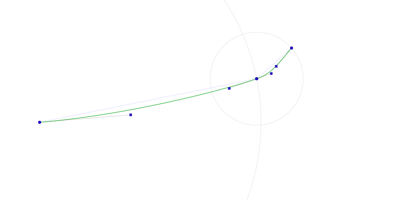
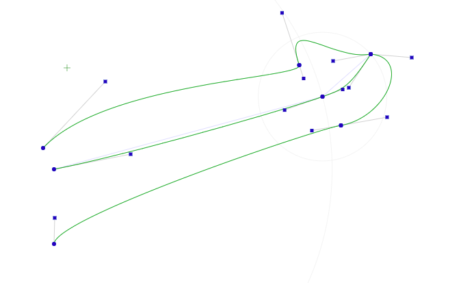

# NG-DG (Codename)
This project is still heavily under construction.

## Todos:
* Change 'fullsize' mode to fit-to-parent, not fit-to-window.
* JSON data export
* JSON data import
* Add 3D preview (with some cool WebGL library).

### Changelog
* 2018-08-29
  * Added Vertex.multiplyScalar(scalar) (as in THREE.Vector2.multiplyScalar).
  * Added crosshair draw for vertex positions.
  * Added CubicBezierCurve.translate(amount).
  * Added top path and bottom path.
* 2018-08-28
  * Function for resizing draw canvas to parent now, not full window.
* 2018-08-27
  * Added fecha.js for date formatting.
  * Added the VertexListeners class.
  * Added basic JSON<->Object transform for the Dildo class.
  * Added a basic dialog class.
* 2018-08-26
  * Initial commit.
  * Added a bezier-drag test in ./tests/.
  * Added the VertexAttr class.
  * Added attr (VertexAttr) attribute to the Vertex class.
  * Added a second draw-instace: one is for filling shapes, one is for drawing outlines.
* 2018-08-16
  * Refactored old dildo-generator classes.

###
Dependencies
* CSS3 Flex
* HTML5 Canvas
* HTML5 WebGL

### Used Libraries
* fecha.js
  * https://github.com/taylorhakes/fecha