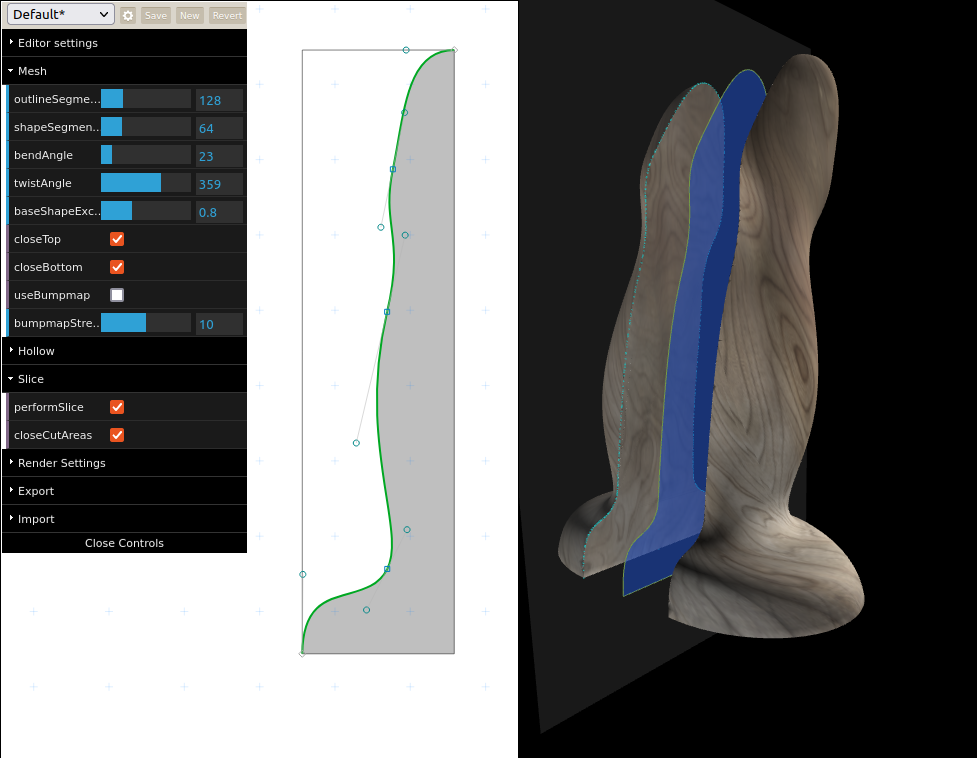

# Dildo Generator: Next Generation

Because 3D printing, 3D web, and dildos are fun.

#### Table of contents

- [Bugs](#bugs)
- [todos](#todos)
- [changelog](#changelos)

## Bugs

- When slicing the mesh with open bottom there are mesh errors.
- Front face, back face and double face switching is not working.

## Todos:

- [x] Configure webpack to handle type definitions in node_modules correctly.
- [x] Port all vanilla JS parts to Typescript.
- [x] Arrange splits on plane.
- [x] Update to THREE >= r125. Replace all THREE.Geometry and THREE.Face3 instances by proper BufferGeometries
      (not supported any more since r125). See https://sbcode.net/threejs/geometry-to-buffergeometry/ for details.
- [x] Rename base branch to 'main'.
- [x] Create a Typescript port from mapbox/earcut.
- [x] Create a Typescript port from tdhooper/threejs-slice-geometry.
- [x] Add a proper Typescript interface for all available dildo generation options.
- [ ] STL-Export: merge all exportable geometries together and export as one.
- [ ] Add a 'Material' switch/tab.
- [ ] Update the package.json's copy scripts (currently using OS dependent `cp` command). Better use an npm compatible copy here.
- [x] Define one global library export to avoid environment pollution.
- [x] Remove unused build libraries: babel, rollup.
- [x] Remove old alloyfinger library. Replace by alloyfinger-typescript.
- [x] Add a session storage for the current settings, especially the Bézier curve..
- [ ] Add a session storage for the bend setting.
- [x] Make the Bézier curve more look like in the old version.
- [x] Add horizonal and vertical scale like in the old version.
- [ ] Fix the string.substr deprecation issue in `isMobileDevice`.
- [x] Add sculptmaps.
- [ ] Show full 2D outline preview (with bend).
- [ ] Convert all `var` to `const` where possible.
- [ ] Add proper and complete TSDoc comments.
- [ ] Upgrade to Typescript 5.
- [ ] Install latest Plotboilerplate 1.26.0 (requires Typescript 5).

### LocalStorage

The following config values are stored in the `LocalStorage`:

- `bezier_path`
- `bend_angle`
- `twist_angle`
- `base_shape_excentricity`

### Toggle 2d silhouette view

http://localhost:8080/public/index-dev.html?drawRulers=0&drawResizeHandleLines=0&drawOutline=0&fillOutline=0&drawRaster=0&darkmode=0&fitViewToSilhouette=1

### Changelog

- 2026-03-08
  - Adding a progressbar and infinite model generation to the randomizer.
- 2026-03-06
  - Fixing an error in the STL exportet (class path).
  - Finalizing a simple sculpt map viewer.
- 2026-03-02
  - GUI: removed the GUI-Size-Toggler: is now part of PlotBoierplate.
  - Replacing dat.gui by lil-gui.
  - Replacing `bezier2polygoon()` by `BezierPath.getEvenDistributionVertices()`.
- 2026-03-01
  - Adding several new flags for drawing and hiding 2D element from the canvas.
- 2026-02-25
  - Fixing package json: replacing relative path for threejs-slice-geometry-typscript library by proper npm package.
  - Adding class `SculptMap`.
  - Adding `DildoGeometry.getBounds` method.
  - Adding a dialog feature for displaying the sculpt map.
- 2022-02-23
  - Added proper types to all function params.
- 2022-02-22
  - Replaced THREE.Geometry by ThreeGeometryHellfix.Gmetry.
  - Upgrading all components to work with Gmetry or BufferGeometry.
  - Upgraded threejs from r124 (with Geometry class) to r137 (without Geometry class).
  - Renamed `./public/index.html` to `./public/index-dev.html`.
  - Renamed `./public/index-build.html` to `./public/index.html`.
  - Fixed wrong display of `diameter` in stats.
- 2022-02-02
  - Fixed the localstorage loading issue.
  - Fixed the replace-path issue (destroying all installed event handlers and listeners first).
  - Added an option for double-size dat.gui.
  - Fixed a split-path issue (double installed event listeners after the action).
  - Added FileDrop for dropping JSON files (path files containing a Bézier path).
- 2021-12-03
  - Refactored the code for resizing the path.
  - Upadted to plotboilerplate@1.14.0.
  - Refactored the code to draw rulers into a separate file.
  - Added action buttons for quickly start over with a new model, and to scale the view to best screen fit.
  - Can restore older models from localstorage now. Models are saved in a 10 second interval.
- 2021-12-01 (World AIDS day)
  - Refactored the resize handles into a new helper class: BezierResizeHelper.
  - Added basic localstorage support to the ConfigIO class.
- 2021-11-30
  - Added resize handles to vertically and horizontally resize the model (path).
- 2012-11-12
  - Added basic rulers to the 2d canvas.
  - Fixed the broken scale-to-best-fit function.
- 2021-09-27
  - Replaced in internal earcut implementation by an node module (https://www.npmjs.com/package/earcut-typescript).
- 2021-09-26
  - Replaced the old build tool chain by a clean one (https://github.com/IkarosKappler/tswebpack).
- 2021-08-29
  - Ported most of the classes to Typescript.
- 2021-08-04
  - Complete refactor.
  - Using PlotBoilerplate for 2D drawing now.
  - Using AlloyFinger-typescript for touch gestures.
- - BREAK - DID OTHER STUFF IN BETWEEN - AND CORONA WAS/IS THERE -
- 2018-08-30
  - Moved the listener setup to the dildo class.
  - Added drag listeners to last end points and last end control points.
- 2018-08-29
  - Added Vertex.multiplyScalar(scalar) (as in THREE.Vector2.multiplyScalar).
  - Added crosshair draw for vertex positions.
  - Added CubicBezierCurve.translate(amount).
  - Added top path and bottom path.
- 2018-08-28
  - Function for resizing draw canvas to parent now, not full window.
- 2018-08-27
  - Added fecha.js for date formatting.
  - Added the VertexListeners class.
  - Added basic JSON<->Object transform for the Dildo class.
  - Added a basic dialog class.
- 2018-08-26
  - Initial commit.
  - Added a bezier-drag test in ./tests/.
  - Added the VertexAttr class.
  - Added attr (VertexAttr) attribute to the Vertex class.
  - Added a second draw-instace: one is for filling shapes, one is for drawing outlines.
- 2018-08-16
  - Refactored old dildo-generator classes.

###

Dependencies

- [theejs](https://threejs.org/)
- [threejs-slice-geometry](https://github.com/tdhooper/threejs-slice-geometry)

### Used Libraries

- [~~dat.gui~~](https://github.com/dataarts/dat.gui)
- [lil-gui](https://lil-gui.georgealways.com/)
- [nice-forms.css](https://nielsvoogt.github.io/nice-forms.css/#installation)

### Credits

- [mapbox](https://github.com/mapbox/earcut) for the [earcut library](https://www.npmjs.com/package/earcut)
- [tdhooper](https://github.com/tdhooper/threejs-slice-geometry/) for the [threejs-slice-geometry library](https://www.npmjs.com/package/threejs-slice-geometry)
- [jkmott about computing vertex normals](https://meshola.wordpress.com/2016/07/24/three-js-vertex-normals/) as used in the `computeVertexNormals` function.
