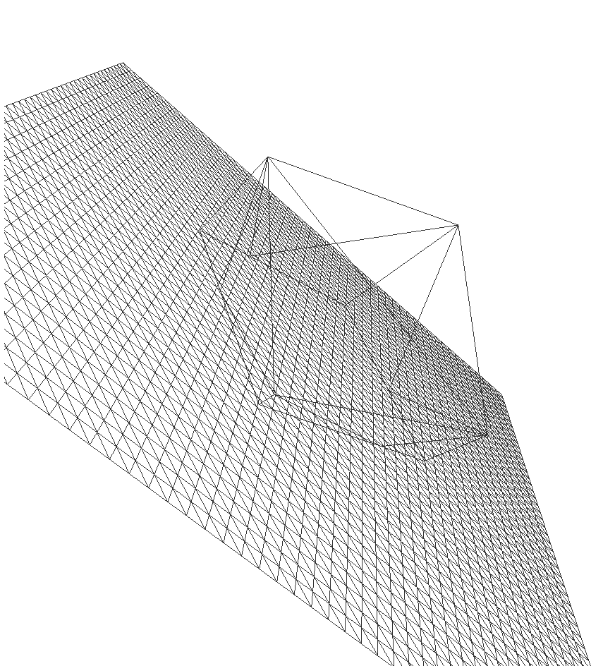

# three-geometry-hellfix

A backport for the THREE.Geometry that went missing since r125. Name: `TGH.Gmetry`.

In the old days one would have created custom geometries like this (using the
`THREE.Geometry` class):

```javascript
import * as THREE from "three";

var myGeometry = new THREE.Geometry();
for (var i = 0; i < 100; i++) {
  myGeometry.vertices.push(new THREE.Vertex(Math.random() * 100, Math.random() * 100, Math.random() * 100));
}

for (var i = 0; i < 20; i++) {
  myGeometry.faces.push(
    new THREE.Face3(Math.floor(Math.random() * 100), Math.floor(Math.random() * 100), Math.floor(Math.random() * 100))
  );
}
```

Doing that with a threejs revision version > 0.124.\* you will receive this error:

```
 error TS2339: Property 'Face3' does not exist on type '../@types/three/index")'.

70   new THREE.Face3( 1, 2,3 );
               ~~~~~

```

Or this

```
 error TS2339: Property 'Geometry' does not exist on type '../@types/three/index")'.

8   new THREE.Geometry();
               ~~~~~
```

This is because THREE.Geometry (and Face3) were removed in r125:
https://discourse.threejs.org/t/three-geometry-will-be-removed-from-core-with-r125/22401

There is a migration guide
https://sbcode.net/threejs/geometry-to-buffergeometry/

but in my opinion the guide's solution is more a workaround of how to convert your short
code from using THREE.Geometry to the extensive manner of expressing the code with THREE.BufferGeometry.
The BufferGeometry is surely a way more efficient implementation according to WebGL (as it is
using float arrays/buffers instead of vertex and face arrays), but if you were used to create
your geometries programmatically porting all your code this way is just a very fresh kind of hell.

I wonder why the maker(s) of THREE did not just restrict the use of THREE.Geometry to
generative purposes, and once the geometry was created convert it to BufferGeometry to
get it rendered.

To here is my solution for our kind of folks:
It's the original file https://github.com/mrdoob/three.js/blob/dev/examples/jsm/deprecated/Geometry.js
from the THREE project, ported to Typescript. And I splitted the file up and added types.

Use it like this now:

```javascript
import { Gmetry, Face3 } from "three-geometry-hellfix";

var myGeometry = new Gmetry(); // Different name!
for (var i = 0; i < 100; i++) {
  myGeometry.vertices.push(new THREE.Vertex(Math.random() * 100, Math.random() * 100, Math.random() * 100));
}

for (var i = 0; i < 20; i++) {
  myGeometry.faces.push(
    new Face3(Math.floor(Math.random() * 100), Math.floor(Math.random() * 100), Math.floor(Math.random() * 100)) // and here, too!
  );
}

var bufferGeometry = myGeometry.toBufferGeometry();
// ... create mesh and add to scene ...
// ...
scene.add(new Mesh(bufferGeometry, material));
// ...
```

## Logical separation from the `threejs` library

All direct calls to any THREE classes got separated out in this implementation (Vector2, Vector3, Matrix3,
Matrix4, BufferGeometry, BufferAttribute, Float32BufferAtrribute, Box3, Object3). Instead the `Gmetry`
class (and helper classes) use a factory. The default factory `DefaultFactory` just forwards all
calls to the global `window["THREE"]` instance.

If your `three` object has a different name please
define your own factory. See `./src/ts/interfaces.ts` (`ThreeFactory`) for details.

## Extended `Geometry` and `Face3` classes

For this approach the constructors of these classes have a new parameter: `factory?:ThreeFactory`.
The parameter is optional but you must pass it of you want to use anything else than the default
`window["THREE"]` instance.

## Get the example running

Get a copy of threejs (from https://github.com/mrdoob/three.js/) and copy it to `./example/three/`.
Install all dependencies and run the script `npm run copy_slice_lib`.
Start a local web server (`npm run server`) and load `http://127.0.0.1:8080/example/index.html` in
your browser.

## Warning messages

I kept all warning messages as they came, telling that THREE.somthing is printing an error or
warning. This is because the code is actually not mine and to remind me that it came from the THREE library.

### Note

I renamed the `Geometry` class to `Gmetry` because the maintainers of THREE announced that the
`THREE.BufferGeometry` might be renamed to `THREE.Geometry` in the future (replacing the old
Geometry class).
And I wanted to avoid naming collisions.

#### Demo screenshot

Here I used the new backport with `threejs-slice-geometry`:



#### Credits

- https://github.com/mrdoob/three.js/
- https://github.com/tdhooper/threejs-slice-geometry

Have fun, folks.
Help your friends and do good!
