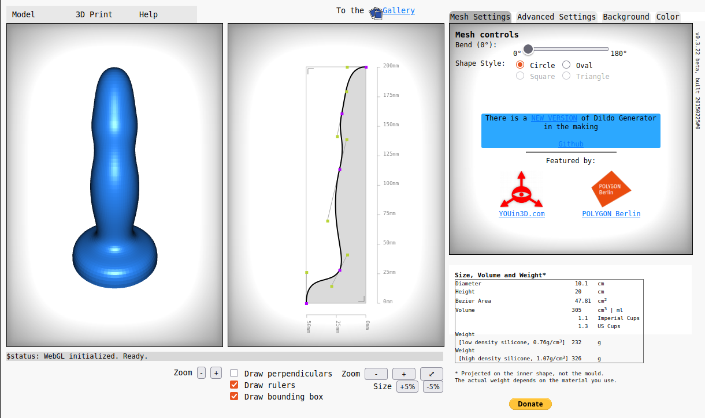
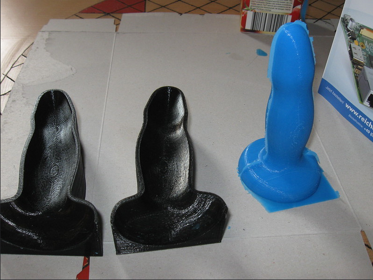

## Dildo Generator v2.

### (Next Generation Dildo Generator)

This software is inspired by an older 3D print and WebGL project. Here is the new version.

Old Version is here:
[Github](https://github.com/IkarosKappler/ngdg)
[Live Demo](http://classic.dildo-generator.com/)

New Version is here:
[Github](https://github.com/IkarosKappler/extrusiongen)
[Live Demo](http://dildo-generator.com/)

#### Idea

Design dildos online and print them – or print a mold and cast liquid silicone inside.

[See our history on Flickr](https://www.flickr.com/photos/123948033@N08/with/15175642467)

### 3D printing

Since 3D printers are available for domestic use it's easy to print at home. If you don't have a printer feel free to reach out to your local 3d print shop.
If you are in Berlin [YOUin3D.com](https://www.youin3d.com/) might be your choice.

